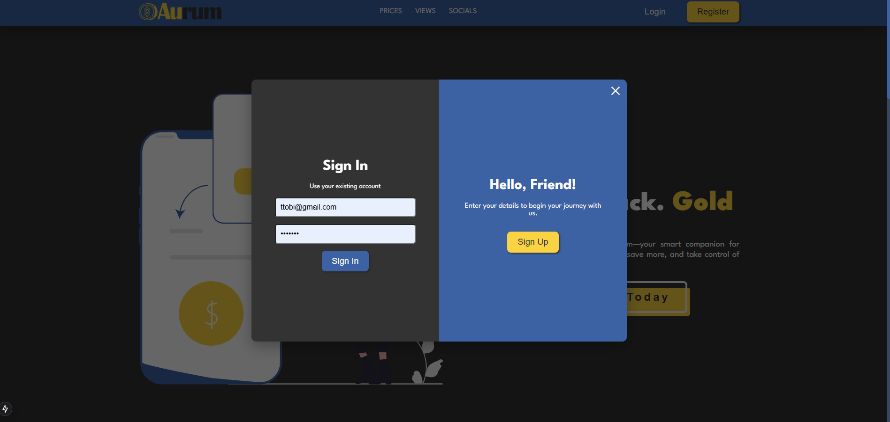
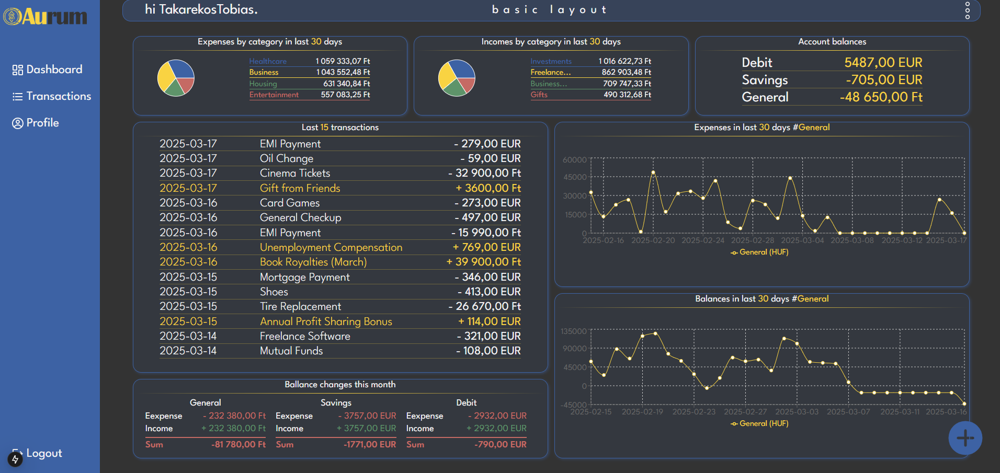
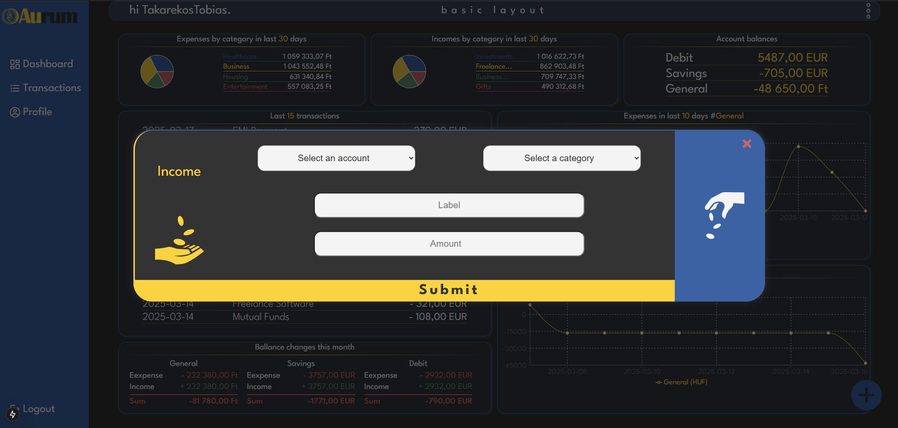
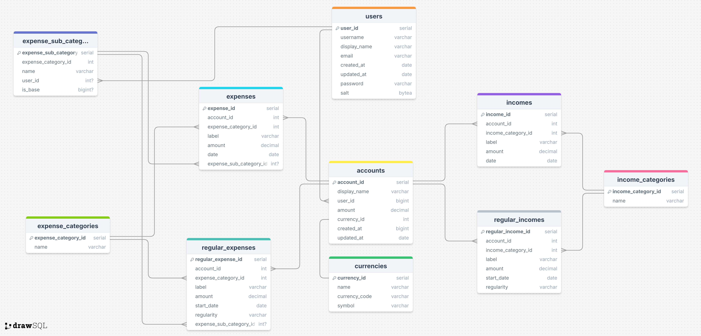

# Aurum Documentation

## Project Overview
**Name:** Aurum  

**Description:**  
Aurum is a personal expense tracker web application showcasing a Next.js frontend, connected to a ASP.NET backend, using an MSSQL database.
The app was made by three of us as a team project - our workflow was based on SCRUM.
We had 5 sprints, daily stand-up meetings to split the tasks, used project board and task delegation.
During development we followed SOLID principles and Clean Code methodology, implemented CI in github actions.
The product runs in Docker containers.

## Snapshots:
 
 
 


##  1. Main features: 
- Register user
- Add accounts for user
- Add expenses / incomes to accounts
- Check data in various customizable charts
- Sort dashboard by different layouts
- List - sort - filter transactions
- Manage accounts
- Manage user
- Responsive mobile view

## 2. Technology Stack
- **Frontend:**
[![React][React.js]][React-url]
[![Next][Next.js]][Next-url]
[![Sass][Sass-logo]][Sass-url]
- **Backend:**
[![ASP.NET Core][AspNet-logo]][AspNet-url]
[![C#][Csharp-logo]][Csharp-url]
- **Database:**
[![MSSQL][Mssql-logo]][Mssql-url]
[![Entity Framework][Ef-logo]][Ef-url]
- **Containerization:**
[![Docker][Docker-logo]][Docker-url]
- **Version Control:**
[![Git][Git-logo]][Git-url]
[![GitHub][Github-logo]][Github-url]
 
## 3. Installation and Running

- **Github repo:** https://github.com/Aurum-ElProyecteGrande/aurum/

### 3.1. Prerequisites
- Node.js & npm
- .NET SDK
- MSSQL

### 3.2 Enviroment variables
- **RawSeedDataPath** *sets path for the folder with .csv files for the seeder in docker (default: "/app/raw-seeding-data")
- **Database:ConnectionString**
- **Database:DbPassword**
- **Token:Issuer**
- **Token:Audience**
- **Token:Key**

### 3.2. Starting the Backend
```sh
cd Backend
cd Aurum
dotnet restore
dotnet run
```

### 3.3. Starting the Frontend
```sh
cd Frontend
npm install
npm run dev
```

### 3.4. Initialize the Database
```
dotnet ef database update
```
- integrated dataseeding sets up up-to-date 

### 3.5 External dependencies
- https://freecurrencyapi.com/docs/currencies#request-parameters

## 4. Usage Examples

### 4.1. Controllers / API Endpoints
- **AccountController** 
	*/account GET -> GetAll()
	*/account POST -> Create()
	*/account/{accId} PUT -> Update()
	*/account/{accId} Delete -> Delete()
- **BalanceController**
	*/balance/{accId} GET -> GetBalance()
	*/balance/{accId/range} GET -> GetBalanceForRange()
- **CurrencyController**
	*/currency GET -> GetAll()
- **ExpenseController**
	*/expenses/{accId} GET -> GetAll()
	*/expenses/{accId}/{startDate}/{endDate} GET -> GetAllWithDate()
	*/expenses POST -> Create()
	*/expenses/{expenseId} DELETE -> Delete()
- **IncomeController**
	*/income/{accId} GET -> GetAll()
	*/income POST -> Create()
	*/income/{incomeId} DELETE -> Delete()	
- **LayoutController**
	*/layout/basic POST -> CreateBasicLayout()
	*/layout/scientic POST -> CreateScienticLayout()
	*/layout/detailed POST -> CreateDetailedLayout()
	*/layout/{userId} GET -> GetAll()
- **UserController**
	*/user GET -> GetUserInfo()
	*/user PUT -> Update()
	*/user DELETE -> Delete()
	*/user/register POST -> Register()
	*/user/login POST -> Authenticate()
	*/user/password-change PUT -> PasswordChange()
	*/user/validate GET -> Validate()
	*/user/logout POST -> Logout()

## 5. Architecture
The project is built with a **RESTful API backend** and a **component-based frontend**.

## 6. Database Structure (SQL)


## 7. Contribution
- **Fork the repo**
- **Create a branch**
- **Submit a PR**

## 8. Contact
Developers: **[Bartos Gábor, Fekete Nándor, Gelecsák Tamás]**  
Emails: **[aurumelproyectegrande@gmail.com]**  
LinkedIns: **[https://www.linkedin.com/in/dashg, https://www.linkedin.com/in/nándor-fekete-fn97, https://www.linkedin.com/in/tamasgelecsak]**


[Next.js]: https://img.shields.io/badge/next.js-000000?style=for-the-badge&logo=nextdotjs&logoColor=white
[Next-url]: https://nextjs.org/
[React.js]: https://img.shields.io/badge/React-20232A?style=for-the-badge&logo=react&logoColor=61DAFB
[React-url]: https://reactjs.org/
[Sass-logo]: https://img.shields.io/badge/Sass-CC6699?style=for-the-badge&logo=sass&logoColor=white
[Sass-url]: https://sass-lang.com/
[AspNet-logo]: https://img.shields.io/badge/ASP.NET_Core-5C2D91?style=for-the-badge&logo=dotnet&logoColor=white
[AspNet-url]: https://dotnet.microsoft.com/en-us/apps/aspnet
[Csharp-logo]: https://img.shields.io/badge/C%23-239120?style=for-the-badge&logo=csharp&logoColor=white
[Csharp-url]: https://learn.microsoft.com/en-us/dotnet/csharp/
[Mssql-logo]: https://img.shields.io/badge/Microsoft_SQL_Server-CC2927?style=for-the-badge&logo=microsoft-sql-server&logoColor=white
[Mssql-url]: https://www.microsoft.com/en-us/sql-server
[Ef-logo]: https://img.shields.io/badge/Entity_Framework-512BD4?style=for-the-badge&logo=.net&logoColor=white
[Ef-url]: https://learn.microsoft.com/en-us/ef/
[Docker-logo]: https://img.shields.io/badge/Docker-2496ED?style=for-the-badge&logo=docker&logoColor=white
[Docker-url]: https://www.docker.com/
[Git-logo]: https://img.shields.io/badge/Git-F05032?style=for-the-badge&logo=git&logoColor=white
[Git-url]: https://git-scm.com/
[Github-logo]: https://img.shields.io/badge/GitHub-181717?style=for-the-badge&logo=github&logoColor=white
[Github-url]: https://github.com/
